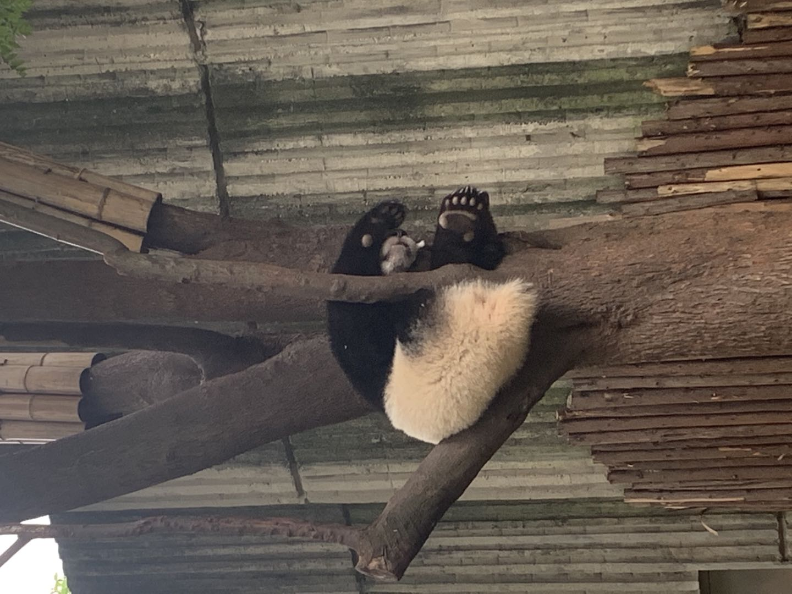
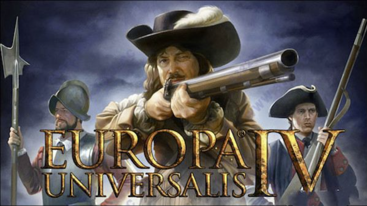

# Data science and me.
  I'm a first-year student of biostatistics in Columbia Mailman public health school. I studied environmental science in undergraduate so data science it's  kind of a new start for me. Before attending this class, I studied several class about R programming and data science from Johns Hopkins University on coursera and that really help me a lot to accept the concepts and get familiar with using R to analyze data.
  
  [Coursera is a good source of courses](https://www.coursera.org)
  
  [Take a series of data science courses](https://www.coursera.org/specializations/jhu-data-science)
  
# Greeting
  Come and say Hi to my favorite animal: pandas

# My hobby
  I'm a big fan of history and video games, which make me love Europa Universalis the most. It's a fantastic historical simulation game, you can play whatever country you like during the time period 1444-1821, follow the trajectory of history and 'make it great'.
  
  